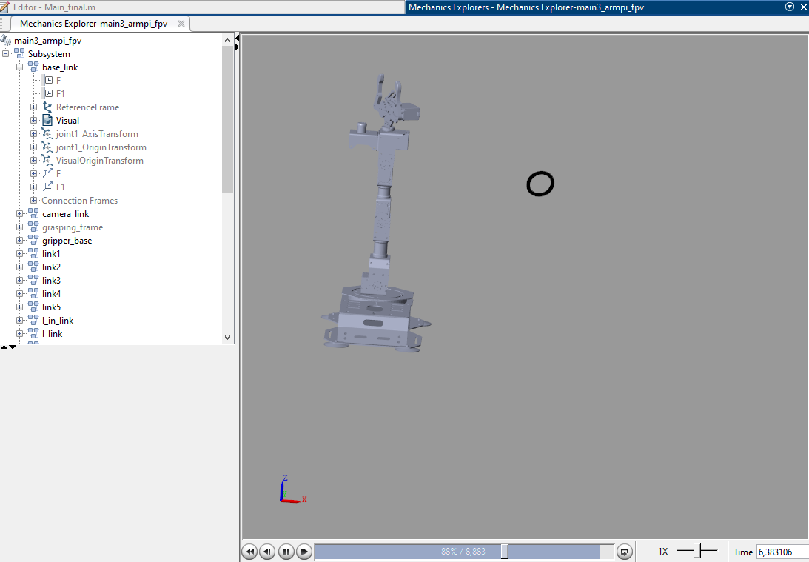
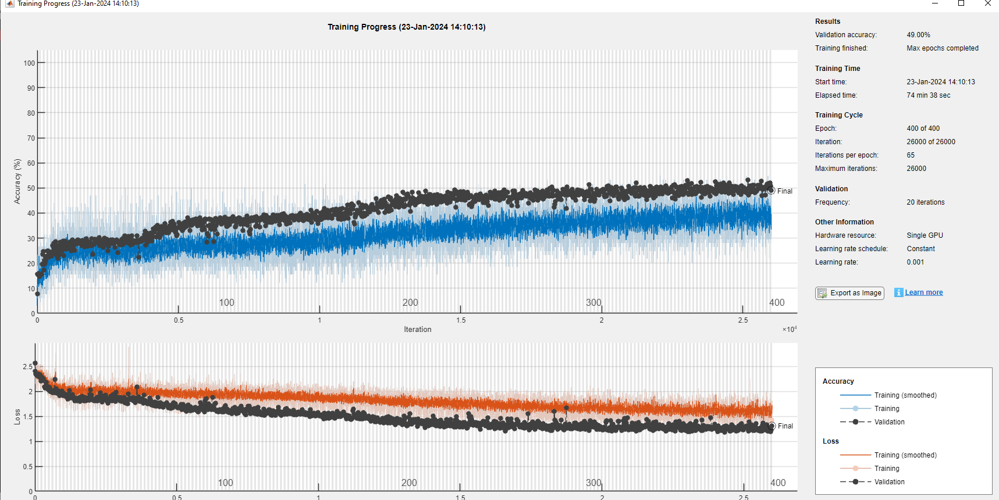

# Digital Twin & Model Training - An overview

This file contains some explanations and examples regarding the digital twin, how to use it to generate usable data, and use said data to train AI models, as well as ways to use trained models on real robot measured data.

## Preparations and set-up

Using the code described in the following sections requires Matlab R2023. The Deep Learning Toolbox will be required to use the AI models. Setting up a [GPU](https://se.mathworks.com/help/parallel-computing/identify-and-select-a-gpu-device.html) in Matlab is highly recommended to perform training operations in reasonable timeframe, and by default the code is written to assume a GPU is available (author's note - this can be changed later on if required).
The code makes widespread use of relative filepaths, and altering the locations and names of files should be done with care. 

The code is entirely geared towards usage for the Hiwonder ArmPi FPV robot arm. Altering it for use with another robot would require a number of corrections, listed as they come up in the following structure overview.

## General structure overview

The digital twin itself is entirely contained in the .slx file main3_armpi_fpv (author's note - placeholder name), which interacts with a subsystem.slx file largely generated by Matlab from the manufacturer-provided URDF file for the Hiwonder ArmPi FPV. Changing robots will require to regenerate a new .slx with smimport, and adjust both the number of motors and the PID parameters in main3_armpi_fpv.slx.

Generation of the dataset is performed by main_final.m. This modulable file allows for a number of parameters to be controlled, including types of errors, types of trajectories present in the dataset, size of the dataset, etc... (author's note - to be explained in greater detail). The generated datasets are saved as a structure, containing a cell array of 6*specified length arrays corresponding to individual simulated trajectories with a specific error.

All AI model files (author's note - list to be given here) allow the user to specify a saved dataset in the correct format, and can then be run to train a model of the specified format.

Besides from this core training aspect, the shape_test.m file (author's note - placeholder name) allows a user to input either a desired 3D trajectory, a desired set of motor commands, or a series of target motor coordinates paired with a duration for each (provided as two .csv files, see examples). The file will then simulate a response to this command, and generate a datapoint for it. If the real response is also provided, it will generate a datapoint for it as well - this can be used to predict the failure state of the robot arm during the provided sample. (author's note - this will be expanded later in a separate file to constitute a proper prediction file, directly paired with the real robot to provide continous monitoring).

## Sample usage - expected results

All files have been provided with default values allowing for test usage simply by running them. 

### Dataset generation

If your Simulink model parameters have the viewer on, any simulation should open a window similar to this one : 

An empty or incomplete display most likely means a problem with the filepaths inside the "visual" blocks within subsystem.slx.

### Model training

A sample dataset is provided to test model training. Running a model should open a window similar to this one :

### Trajectory simulation

Sample trajectories and motor command .csv files are provided. Running shape_test.m should display motor-by-motor comparisons of the simulation and the real trajectory, with multiple figures similar to this one :

